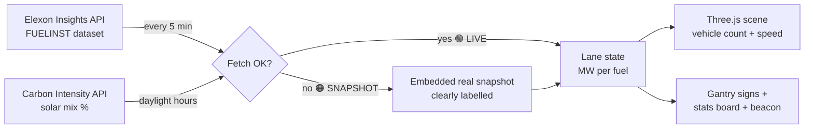

# ⚡ UK Grid // Tron Motorway

**Great Britain’s live electricity generation mix, visualised as a 3D Tron motorway.**
Every vehicle ≈ 400 MW. More generation = more traffic, moving faster.

[](https://ahmed19940121.github.io/grid-tron-/)


-----

## 🛣️ What you’re looking at

Eight neon highways converge on the **UK Grid Interchange**. Each carriageway is one
generation type, and the traffic on it is the live output of that fuel — pulled from
the Elexon (BMRS) Insights API every five minutes, the same cadence the grid publishes at.

|Lane   |Vehicle                      |Colour  |Live source                         |
|-------|-----------------------------|--------|------------------------------------|
|Wind   |🚗 Cars                       |🟢 Green |`WIND`                              |
|Solar  |🏍️ Motorbikes                 |🟡 Yellow|Estimated from Carbon Intensity mix*|
|Gas    |🚛 HGV lorries                |🟠 Orange|`CCGT` + `OCGT`                     |
|Nuclear|🚌 Buses (steady)             |🔵 Blue  |`NUCLEAR`                           |
|Hydro  |🚤 Boats on a water lane      |🩵 Cyan  |`NPSHYD`                            |
|Biomass|🚜 Tractors                   |🟢 Lime  |`BIOMASS`                           |
|Imports|🚚 Container trucks via tunnel|🟣 Purple|All `INT*` interconnectors, netted  |
|Storage|🚐 Vans, both directions      |⚪ Silver|`PS` (pumped storage)               |

* Solar is embedded generation — it never appears on the transmission system, so
FUELINST can’t see it. The app estimates it live from the Carbon Intensity API’s
national mix percentage and labels it accordingly.

## 📏 The rules of the road

- **Traffic volume** — 1 vehicle ≈ 400 MW, capped at 24 per lane
- **Traffic speed** — each lane accelerates with its share of typical peak output
  (wind at 16 GW would properly fly)
- **Direction matters** — net importing sends trucks out of the tunnel toward the
  interchange; net exporting reverses them. Storage vans run inbound when
  discharging, outbound when charging
- **Gantries** — every highway has an overhead gantry showing the fuel name and
  live MW, redrawn on each refresh. The central beacon shows total GW in transit

## 🔌 How it works



Single HTML file. No build step, no backend, no API key — Elexon’s open API
allows browser requests directly. If the live feed is unreachable, the app
degrades gracefully to an embedded real snapshot with an amber indicator
rather than showing stale data as live.

## 🚀 Run it yourself

```bash
git clone https://github.com/ahmed19940121/grid-tron-.git
cd grid-tron-
# open index.html in any browser — that's it
```

Or just visit the [live demo](https://ahmed19940121.github.io/grid-tron-/).
Drag to orbit, scroll to zoom. Best watched during the morning ramp
(05:30–08:00 UK) when demand climbs and the solar bikes join the road.


## 👤 Author

**Ahmed Nur** — UK energy contracts & commercial specialist · AI/ML practitioner
Building Claude-native tools for the energy sector, including
[Grid Guardian](https://github.com/ahmed19940121) (grid connection queue intelligence).

Connect on [LinkedIn](https://www.linkedin.com/) · More repos at [@ahmed19940121](https://github.com/ahmed19940121)

-----

*Data: © Elexon Limited (BMRS/Insights API) · Carbon Intensity API (National Energy
System Operator / University of Oxford). This is an independent visualisation,
not affiliated with Elexon or NESO.*
